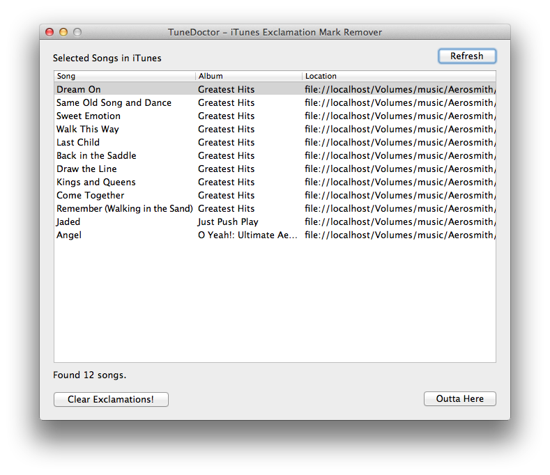

TuneDoctor
==========
The Mac OSX app that fixes exclamation points in iTunes.

The Problem
-----------
For those of us with massive iTunes music libraries located on external storage like a NAS, using iTunes can be a headache.  When manipulating your songs, if the NAS is in powersaving mode then iTunes will think your songs are missing!  It then puts a nice little explamation point next to the song title and it won't sync with your phone anymore.

The Solution
------------
You can fix it manually yourself by playing each song, one by one.  That works, but it takes forever.  This program takes the manual part out of it.  Just run iTunes, select the songs or albums with exclamation points to fix, run this program, and click the "Remove!" button.

Getting TuneDoctor
------------------
If you're lazy like me, you just want to download and run the program.  Unfortunately, Github doesn't like large binaries anymore so I'm looking at alternatives.  In the meantime, I've you're handy with XCode you can pretty easily make the app.  You need:

* Mac OSX 10.6 or above / 64-bit
* iTunes 10.0 or above (may work on older versions as well)
* XCode 4.6.1 or above (may work on older versions as well)

Download the source code and open the project up in XCode.  Then run it or build the TuneDoctor.app file and run that.  You should see the screen above.  

Using TuneDoctor
----------------
Using TuneDoctor is reasonably easy.  

1. Ensure the device(s) holding your songs is powered up and accessible by your Mac.
1. The connection to your song storage device __should be hard-wired - no WiFi__.  Otherwise the process will take too long.
1. Open iTunes and select some songs with exclamation points next to them.  For the first run, only select a handfull of songs to get a good idea of your performance.
1. Run the program and make sure the songs show up in the interface.  If not, click "Refresh".
1. Click the "Clear Exclamations!" button and watch the magic.

After the program runs, the exclamantion points should be gone.  You can then get these files to sync up to your iPhone.

Stuff That Could Be Better
--------------------------
The program works, but there are a lot of nice enhancements that could be made.  Go ahead and grab the source and make it so.  Here are a few things to start with:

* Implement background processes so the interface stays responsive if the connection is slow
* Allow the user to cancel during operation
* Cool icon

How It Works
------------
It's pretty simple.  iTunes allows a lot of automation.  TuneDoctor reads the selected songs, and then just tries to play each one of them.  Even though the song location appears to be missing in the iTunes database, it still knows where the song should be.  If iTunes finds it, the exclamation point goes away.

License
-------
Copyright (c) 2011-2013 John Baumbach <john.j.baumbach@gmail.com>

This program is free software: you can redistribute it and/or modify it under the terms of the GNU General Public License as published by the Free Software Foundation, either version 3 of the License, or (at your option) any later version.

This program is distributed in the hope that it will be useful, but WITHOUT ANY WARRANTY; without even the implied warranty of MERCHANTABILITY or FITNESS FOR A PARTICULAR PURPOSE.  See the GNU General Public License for more details.

You should have received a copy of the GNU General Public License along with this program.  If not, see <http://www.gnu.org/licenses/>.

